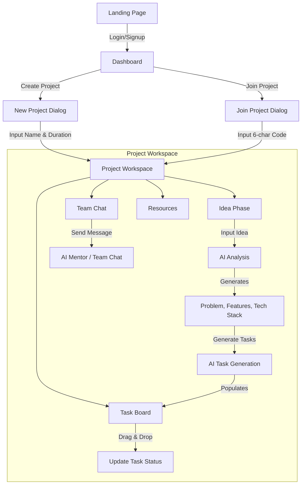

# HackMate AI - Project Overview & User Flow

## 🔄 User Flow Diagram

## 🚀 Detailed User Journey

### 1. Onboarding & Dashboard
- **Landing**: Users start at the landing page.
- **Authentication**: Secure login via Firebase (Google/GitHub).
- **Dashboard**: The central hub where users can:
    - **View Projects**: List of all active hackathon projects.
    - **Create Project**: Start a new project by providing a name and selecting a duration (24h or 48h).
    - **Join Project**: Enter a unique 6-character code to join an existing team.
    - **Offline Mode**: View cached projects even without internet connection.

### 2. Project Initialization (The "Idea" Phase)
- **Idea Input**: Users describe their hackathon idea in natural language.
- **AI Analysis**: The system (powered by Gemini via OpenRouter) analyzes the idea to generate:
    - **Problem Statement**: Clear definition of the issue being solved.
    - **Target Users**: Who the product is for.
    - **Key Features**: List of MVP features.
    - **Tech Stack**: Recommended technologies.
    - **Risks**: Potential challenges.
    - **Planning**: Users review and refine this AI-generated plan.

### 3. Task Management (The "Execution" Phase)
- **Auto-Generation**: One-click generation of actionable tasks based on the approved features.
- **Kanban Board**: A drag-and-drop interface with columns:
    - **To Do**: Pending tasks.
    - **In Progress**: Currently being worked on.
    - **Done**: Completed items.
- **Real-time Sync**: All changes (moves, edits, assignments) are synced instantly to all team members.

### 4. Collaboration & Assistance
- **AI Mentor Chat**: A built-in chat interface where users can ask technical questions, get debugging help, or ask for pitch advice. The AI has context of the current project idea.
- **Team Chat**: Real-time messaging for team coordination.
- **Live Activity Feed**: See who is doing what (e.g., "Alice moved Task A to Done").
- **Shared Resources**: Upload files or share links (Figma, GitHub, Docs) with the team.

### 5. Project Management
- **Milestones**: Automatic milestones based on the chosen duration (e.g., "Prototype due in 12h").
- **Timer**: Countdown timer showing remaining hackathon time.
- **Demo Mode**: Toggle a public read-only view for judges to see the progress without editing rights.

## 🛠 Technical Architecture

### Frontend
- **Framework**: Next.js 14 (App Router)
- **Language**: TypeScript
- **Styling**: Tailwind CSS + ShadCN UI
- **State Management**: React Hooks + Context API
- **Drag & Drop**: `@dnd-kit`

### Backend & Data
- **Database**: Firebase Firestore (NoSQL)
    - Real-time listeners (`onSnapshot`) for instant updates.
- **Authentication**: Firebase Auth
- **API**: Next.js API Routes (`/api/gemini`) acting as a proxy to OpenRouter.

### AI Integration
- **Provider**: OpenRouter
- **Model**: Google Gemini
- **Functions**:
    - `analyze_idea`: Structured JSON output for project planning.
    - `generate_tasks`: Array of task objects.
    - `mentor_chat`: Context-aware conversational responses.
